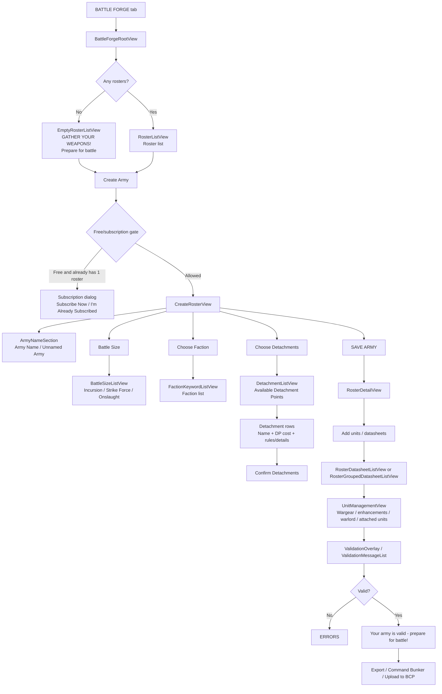
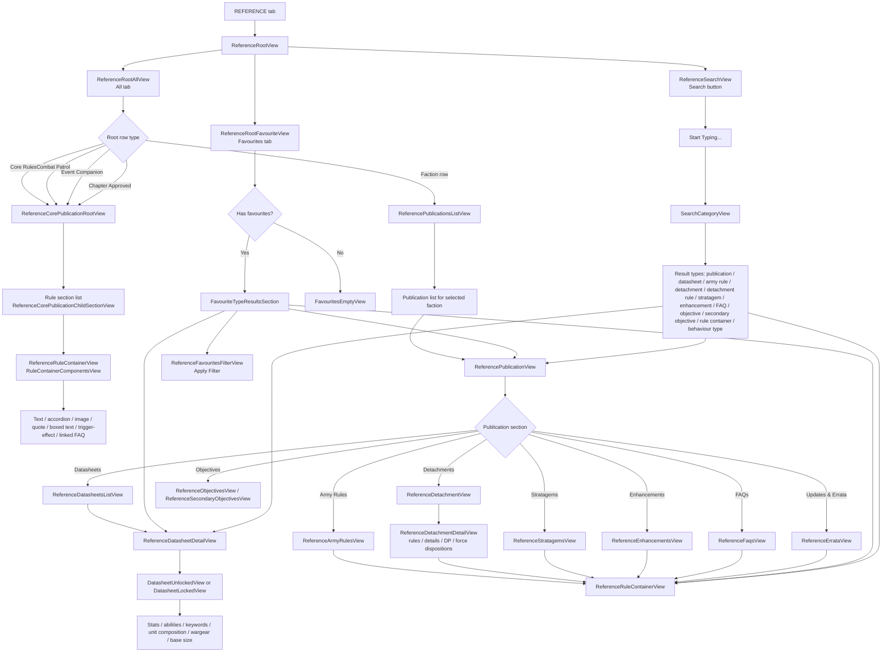

# WH 40K App UI Research

Captured: 2026-06-24

## App Identity

- Local app: `/Applications/WH 40K.app`
- Real bundle: `/Applications/WH 40K.app/Wrapper/w40.app`
- Display name: `WH 40K`
- App Store name: `Warhammer 40,000: The App`
- Bundle id: `com.gamesworkshop.w40k`
- Version: `2.0.3`
- Bundle version: `1`
- Platform: iOS/iPadOS app running on macOS
- UI stack: SwiftUI-style modular app with View/ViewModel symbols left in the binary
- Local database stack: GRDB / SQLite-like seeded data
- Seed data file: `/Applications/WH 40K.app/Wrapper/w40.app/Datasource_SeedDatasource.bundle/dump.json`
- Data version: `879`

## Main Navigation

The top-level app uses a horizontal segmented tab bar:

- `REFERENCE`
- `BATTLE FORGE`
- `WAR JOURNAL`
- `PROFILE`

The visible main `REFERENCE` screen uses a black background with a centered vertical list of white rounded rows. It has:

- `All / Favourites` segmented control
- Search button
- Initial rows: `Core Rules`, `Combat Patrol`, `Event Companion`, `Chapter Approved`
- Then faction/publication rows such as `Adepta Sororitas`, `Adeptus Custodes`, `Adeptus Mechanicus`, `Aeldari`, etc.

## Major Modules

### Reference

Observed ViewModel / screen names:

- `ReferenceRootAllViewModel`
- `ReferenceRootFavouriteViewModel`
- `ReferenceFavouritesFilterViewModel`
- `ReferenceSearchViewModel`
- `ReferencePublicationsListViewModel`
- `ReferencePublicationViewModel`
- `ReferenceCorePublicationRootViewModel`
- `ReferenceCorePublicationChildSectionViewModel`
- `ReferenceArmyRulesViewModel`
- `ReferenceDatasheetsListViewModel`
- `ReferenceDatasheetDetailViewModel`
- `ReferenceDetachmentViewModel`
- `ReferenceStratagemsViewModel`
- `ReferenceEnhancementsViewModel`
- `ReferenceFaqsViewModel`
- `ReferenceErrataViewModel`
- `ReferenceObjectivesViewModel`
- `ReferenceSecondaryObjectivesViewModel`
- `ReferenceDatasheetAbilityInfoViewModel`
- `ReferenceWargearAbilityInfoViewModel`

Reference content appears to be data-driven from publications, rule sections, rule containers, datasheets, detachments, stratagems, enhancements, FAQ, errata, objectives, and favourites.

Core Rules top-level sections:

- `01. Core Concepts`
- `02. Datasheets`
- `03. Moving`
- `04. Making Attacks`
- `05. Attack Sequence`
- `06. Other Concepts`
- `07. The Battle Round`
- `08. Command Phase`
- `09. Movement Phase`
- `10. Shooting Phase`
- `11. Charge Phase`
- `12. Fight Phase`
- `13. Terrain`
- `14. Objectives`
- `15. Stratagems`
- `16. Actions`
- `17. Monsters And Vehicles`
- `18. Transports`
- `19. Attached Units`
- `20. Strategic Reserves`
- `21. Flying and Surging`
- `22. Other Rules And Abilities`
- `23. Aircraft`
- `24. Core Abilities`
- `25. Muster Armies`

### Battle Forge

Observed ViewModel / screen names:

- `BattleForgeRootViewModel`
- `BattleSizeListViewModel`
- `CreateRosterViewModel`
- `EditRosterViewModel`
- `EditRosterBattleSizeListViewModel`
- `FactionKeywordListViewModel`
- `DetachmentListViewModel`
- `RosterDetailViewModel`
- `RosterDatasheetListViewModel`
- `RosterGroupedDatasheetListViewModel`
- `UnitManagementViewModel`
- `AttachUnitViewModel`
- `RosterExportViewModel`
- `PlayModeViewModel`
- `PlayModeDatasheetDetailViewModel`
- `ValidationOverlayViewModel`
- `ValidationMessageListViewModel`
- `BattleForgeDatasheetAbilityInfoViewModel`
- `BattleForgeWargearAbilityInfoViewModel`

Observed SwiftUI view/component names:

- `EmptyRosterListView`
- `RosterListView`
- `RosterListRow`
- `RosterListBackground`
- `CreateRosterView`
- `CreateRosterSectionView`
- `EditRosterView`
- `ArmyNameSection`
- `ArmyInformationSection`
- `SaveArmyButton`
- `SelectedDetachmentRow`
- `DetachmentListView`
- `DetachmentRuleListView`
- `BattleForgeDetachmentRulesView`
- `BattleForgeDetachmentDetailsView`
- `FactionKeywordListView`
- `RosterDetailView`
- `RosterDetailOverflowMenu`
- `RosterUnitOverflowMenu`
- `RosterUnitRow`
- `RosterUnitWarlordView`
- `RosterUnitWarningOverlayView`
- `RosterUnitAttachedUnitView`
- `RosterUnitPointsView`
- `RosterUnitLabelView`
- `RosterExportView`
- `RosterExportViewBody`

Battle Forge has a free-version gate:

- Free users are limited to one army roster.
- Subscription dialog strings include `Subscribe Now`, `I'm Already Subscribed`, and Warhammer+ upgrade copy.

### War Journal

Observed ViewModel / screen names:

- `WarJournalRootViewModel`
- `BattleDetailViewModel`
- `BattleSetupFlowRootModel`
- `BattleSetupViewModel`
- `BattleTypeSelectionViewModel`
- `BattleSizeSelectionViewModel`
- `MissionPackSelectionViewModel`
- `MusterArmiesSelectionViewModel`
- `CreateBattlefieldViewModel`
- `DeploymentSelectionGridViewModel`
- `TerrainLayoutSelectionGridViewModel`
- `BattleSetupAddFactionListViewModel`
- `BattleSetupAddDetachmentListViewModel`
- `BattleSetupForceDispositionViewModel`
- `BattleSetupMissionPresetViewModel`
- `BattleSetupMissionTwistViewModel`
- `PrimaryMissionSelectionViewModel`
- `SecondaryMissionsSelectionViewModel`
- `BattleSetupPrimaryMissionViewModel`
- `BattleSetupSecondaryMissionViewModel`
- `BattleSetupFirstTurnViewModel`
- `BattleTrackingViewModel`
- `BattleRoundViewModel`
- `PrimaryMissionScoringViewModel`
- `SecondaryMissionScoringViewModel`
- `BattleResultsViewModel`
- `EndOfBattleOptionsViewModel`
- `ConnectGameViewModel`
- Combat Patrol-specific screens: `CombatPatrolsViewModel`, `CombatPatrolsChoicesViewModel`, `CombatPatrolPrimaryMissionViewModel`, `CombatPatrolEnhancementsViewModel`, `CombatPatrolsAttachUnitViewModel`, `CombatPatrolWargearAbilityInfoViewModel`

War Journal supports:

- Battle history
- Active battle detection
- Battle setup
- Warhammer 40K and Combat Patrol game modes
- Roster selection
- Opponent connection by generated/scanned code
- Mission pack selection
- Battlefield/deployment/terrain selection
- Force disposition
- Primary and secondary missions
- First turn / defender setup
- Round-by-round CP and VP tracking
- End battle / results
- BCP event linkage and score submission

### Profile

Observed Profile strings:

- `Sign In or Register`
- `Logged In User`
- `Not Logged In`
- `Logout`
- `View Subscriptions`
- `User Preferences`
- `Delete my Account`
- `Report a Problem`
- `Privacy Policy`
- `Terms And Conditions`
- `App Version`
- `Data Version`
- `BCP - Logout`

Preference-related strings:

- `Automatic Default Wargear`
- `Automatic Wargear`
- `Profile > Preferences > Automatic Default Wargear`
- `Default wargear will be applied automatically in the roster builder.`

## Create Roster Scenario Map

### Create Roster Screen Details

Likely source screens and components:

- `BattleForgeRootView`
- `EmptyRosterListView`
- `RosterListView`
- `CreateRosterView`
- `CreateRosterSectionView`
- `ArmyNameSection`
- `ArmyInformationSection`
- `BattleSizeListView`
- `FactionKeywordListView`
- `DetachmentListView`
- `SaveArmyButton`

Confirmed strings used in this flow:

- `GATHER YOUR WEAPONS!`
- `Prepare for battle - build your first army now!`
- `Create Army`
- `Army Name`
- `Unnamed Army`
- `Battle Size`
- `Choose Battle Size`
- `Choose Faction`
- `Choose Detachments`
- `Available Detachment Points (DP)`
- `No Detachments`
- `Confirm Detachments`
- `SAVE ARMY`
- `Save Changes`
- `Choose your Detachment, Datasheets and Enhancements to see them here!`

After saving, the app transitions into the roster detail/editor area:

- `RosterDetailView`
- `RosterDatasheetListView`
- `RosterGroupedDatasheetListView`
- `UnitManagementView`
- `AttachUnitView`
- `RosterExportView`
- validation overlay/list

### Battle Sizes

From the seeded database:

| Battle size | Points | Detachment points limit | Enhancement limit | Duplicate unit limit |
| --- | ---: | ---: | ---: | ---: |
| `Incursion` | 1000 | 2 | 2 | 2 |
| `Strike Force` | 2000 | 3 | 4 | 3 |
| `Onslaught` | 3000 | 3 | 4 | 3 |

### Faction Selection

The seeded database contains 43 faction keywords. Some are excluded from army builder, and some have parent factions.

Parent/child example:

- `Adeptus Astartes`
  - `Black Templars`
  - `Blood Angels`
  - `Dark Angels`
  - `Deathwatch`
  - `Imperial Fists`
  - `Iron Hands`
  - `Raven Guard`
  - `Salamanders`
  - `Space Wolves`
  - `Ultramarines`
  - `White Scars`

Faction keyword records include:

- `parentFactionKeywordId`
- `excludedFromArmyBuilder`
- `rosterHeaderImage`
- `armySelectionImage`
- `moreInfoImage`
- `rosterFactionImage`
- `mandatoryWarlordId`
- localized `name`, `commonName`, and `lore`

### Example: Adeptus Mechanicus Creation Data

For `Adeptus Mechanicus`, the database exposes 38 datasheet-faction links and these detachments:

| Display order | Detachment | DP |
| ---: | --- | ---: |
| 0 | `Lords of the Forge` | 1 |
| 0 | `Luminen Auto-Choir` | 1 |
| 0 | `Cohort Acquisitus` | 1 |
| 0 | `Purge Corps Deltic-9` | 1 |
| 1 | `Cohort Cybernetica` | 2 |
| 2 | `Data-psalm Conclave` | 2 |
| 3 | `Explorator Maniple` | 2 |
| 4 | `Rad-Zone Corps` | 2 |
| 5 | `Skitarii Hunter Cohort` | 2 |
| 6 | `Haloscreed Battle Clade` | 3 |
| 7 | `Eradication Cohort` | 3 |

## Reference Scenario Map

### Reference Root

Confirmed top-level UI:

- `ReferenceRootView`
- `ReferenceRootAllView`
- `ReferenceRootFavouriteView`
- `ReferenceSearchView`
- `ReferencePublicationsListView`
- `ReferencePublicationView`

Confirmed root strings:

- `All`
- `Favourites`
- `Reference Search: Button`
- `Start Typing...`
- `All Records Expunged. Try Again?`
- `This is where all of your Favourites will be found. Go to the Reference section and start Favouriting things!`

The visible root screen has four special publication rows before factions:

| Row | Publication id | Notes |
| --- | --- | --- |
| `Core Rules` | `4cdf7a87-0914-49e8-b5df-b9f8be4d13c6` | Free/core rules, errata date `17 June 2026` |
| `Combat Patrol` | `b1db320f-05bc-4da4-a00f-d8ea63f7a621` | Combat Patrol mission sequence |
| `Event Companion` | `085bb508-281f-4a92-a99b-801a5c95c165` | Event, Dominatus, Doubles, Teams companion sections |
| `Chapter Approved` | `0f10beea-e594-4a21-9c0a-67d59f07ccce` | Introduction, Mission Sequence, Appendix |

Faction rows appear to lead into `ReferencePublicationsListView`, then into `ReferencePublicationView`.

### Core Rules Drill-down

Core-like publications use:

- `ReferenceCorePublicationRootView`
- `ReferenceCorePublicationChildSectionView`
- `ReferenceRuleContainerView`
- `RuleContainerComponentsView`

Core Rules top-level sections are listed earlier in this document. For example, `01. Core Concepts` has rule containers:

- `Core Concepts`
- `Armies`
- `Units and Models`
- `Active Player and Opposing Player`
- `Measuring Distances`
- `Dice`
- `Leadership Rolls`
- `Battle-shock Rolls`

Rule content is assembled from `rule_container` and `rule_container_component`.

Observed component types/symbols:

- `RuleContainerTextComponent`
- `RuleContainerAccordionComponent`
- `RuleContainerImageComponent`
- `RuleContainerImageTextComponent`
- `RuleContainerQuoteComponent`
- `RuleContainerBoxedTextComponent`
- `RuleContainerBulletsComponent`
- `RuleContainerHeaderComponent`
- `RuleContainerTriggerEffectComponent`
- `RuleContainerStratagemComponent`
- `RuleContainerEnhancementComponent`
- `RuleContainerBehaviourTypeComponent`
- `RuleContainerLinkedFaqsComponent`
- `RuleContainerUpdatesAndErrataComponent`

### Faction / Publication Drill-down

Likely flow:

1. Tap a faction row, for example `Adeptus Mechanicus`.
2. Open `ReferencePublicationsListView`.
3. Pick a publication, for example `Codex: Adeptus Mechanicus` or `Combat Patrol: Purge Corps Deltic-9`.
4. Open `ReferencePublicationView`.
5. Drill into content sections such as datasheets, detachments, stratagems, enhancements, FAQ, errata, and army rules.

Example `Adeptus Mechanicus` publication list:

| Display order | Publication | Combat Patrol | Errata |
| ---: | --- | --- | --- |
| 11 | `Codex: Adeptus Mechanicus` | false | `17 June 2026` |
| 0 | `Combat Patrol: Purge Corps Deltic-9` | true |  |

Example `Adeptus Astartes / Space Marines` publication list:

| Display order | Publication | Combat Patrol | Errata |
| ---: | --- | --- | --- |
| 0 | `Combat Patrol: Assault Force` | true |  |
| 10 | `Imperial Armour: Astartes` | false | `17 June 2026` |
| 17 | `Codex: Space Marines` | false | `17 June 2026` |

Example `Codex: Adeptus Mechanicus` content counts:

| Section | Count |
| --- | ---: |
| Army rules | 1 |
| Datasheets | 34 |
| Detachments | 10 |
| Stratagems | 51 |
| Enhancements | 34 |
| FAQs | 24 |

Example `Codex: Space Marines` content:

| Section | Count / examples |
| --- | --- |
| Army rules | `Oath of Moment`, `Space Marine Chapters` |
| Datasheets | 101 |
| Detachments | 22 |
| Stratagems | 120 |
| Enhancements | 85 |
| FAQs | 82 |

Space Marines detachments visible in data include:

- `1st Company Task Force`
- `Anvil Siege Force`
- `Firestorm Assault Force`
- `Gladius Task Force`
- `Ironstorm Spearhead`
- `Stormlance Task Force`
- `Vanguard Spearhead`
- chapter-themed entries like `Blade of Ultramar`, `Forgefather's Seekers`, `Hammer of Avernii`, `Shadowmark Talon`

### Datasheet Detail

The datasheet path uses:

- `ReferenceDatasheetsListView`
- `ReferenceDatasheetDetailView`
- `DatasheetUnlockedView`
- `DatasheetLockedView`
- `LockedContentView`
- `LockedContentDialog`

Datasheet detail content is assembled from:

- statline: Movement, Toughness, Save, Wounds, Leadership, Objective Control
- `Ranged Weapons`
- `Melee Weapons`
- `Abilities`
- `Datasheet Abilities`
- `Wargear Abilities`
- `Keywords`
- `Unit Composition`
- `Wargear Options`
- `Additional Wargear`
- `Base Size`
- `Lore`
- `Points`

The presence of `DatasheetLockedView` and `LockedContentDialog` suggests entitlement-gated content for some codex/datasheet material.

### Favourites

Favourites are backed by typed favourite aggregates/results:

- publication
- datasheet
- army rule
- detachment
- detachment rule
- stratagem
- enhancement
- FAQ
- objective
- secondary objective
- rule container
- behaviour type

Relevant views:

- `ReferenceRootFavouriteView`
- `FavouritesEmptyView`
- `FavouriteView`
- `FavouriteTypeResultsSection`
- `ReferenceFavouritesFilterView`

Confirmed strings:

- `Add Favourite`
- `Remove Favourite`
- `%@ added to favourites!`
- `%@ removed from favourites!`
- `FAQ added to favourites!`
- `FAQ removed from favourites!`
- `Error updating favourite!`
- `Apply Filter`

### Search

Search uses:

- `ReferenceSearchView`
- `EmptySearchView`
- `SearchCategoryView`

Observed search result types:

- `PublicationFavouriteAggregate` / `PublicationFavouriteResult`
- `DatasheetSearchAggregate` / `DatasheetSearchResult`
- `ArmyRuleSearchAggregate` / `ArmyRuleSearchResult`
- `DetachmentSearchAggregate` / `DetachmentSearchResult`
- `DetachmentRuleSearchAggregate` / `DetachmentRuleSearchResult`
- `StratagemSearchAggregate` / `StratagemSearchResult`
- `EnhancementSearchAggregate` / `EnhancementSearchResult`
- `FaqSearchAggregate` / `FaqSearchResult`
- `ObjectiveSearchAggregate` / `ObjectiveSearchResult`
- `SecondaryObjectiveSearchAggregate` / `SecondaryObjectiveSearchResult`
- `RuleContainerSearchAggregate` / `RuleContainerSearchResult`
- `BehaviourTypeSearchAggregate` / `BehaviourTypeSearchResult`

Search result taps likely deep-link into the same target views:

- `ReferencePublicationView`
- `ReferenceDatasheetDetailView`
- `ReferenceRuleContainerView`
- section-specific views such as `ReferenceDetachmentView`, `ReferenceStratagemsView`, `ReferenceEnhancementsView`, and `ReferenceFaqsView`

## Seed Data Summary

Counts from `dump.json`:

| Table/content | Count |
| --- | ---: |
| Publications | 69 |
| Faction keywords | 43 |
| Datasheets | 1142 |
| Detachments | 290 |
| Enhancements | 957 |
| Stratagems | 1432 |
| FAQ | 728 |
| Primary missions | 49 |
| Secondary missions | 18 |
| Mission presets | 48 |
| Mission layouts | 46 |
| Mission deployments | 9 |

Important Battle Forge-related tables:

- `battle_size`
- `faction_keyword`
- `detachment`
- `detachment_faction_keyword`
- `detachment_force_disposition`
- `datasheet`
- `datasheet_faction_keyword`
- `unit_composition`
- `miniature`
- `wargear_item`
- `wargear_option`
- `enhancement`
- `stratagem`
- `army_rule`
- `allied_faction`
- `restriction_group_detachment_limit`

Roster persistence and validation symbols mention:

- `roster`
- `roster_detachment`
- `roster_unit`
- `roster_unit_miniature`
- `roster_unit_miniature_wargear_option`
- `roster_unit_miniature_enhancement`
- `roster_attached_unit`
- `roster_attached_unit_roster_unit`
- `roster_validation_state`

Validation-related concepts observed in strings/symbols:

- duplicate unit limits
- enhancement limits
- warlord requirements
- allied faction constraints
- attached unit leader/support requirements
- detachment keyword requirements
- wargear choice set requirements
- wargear limits
- automatic default wargear

## War Journal Data Notes

Mission packs:

- `Chapter Approved 2026-2027`
- `Combat Patrol`

Both have:

- Primary mission score game limit: 45
- Primary mission score battle round limit: 15
- Secondary mission score game limit: 45
- Secondary mission score battle round limit: 15
- Fixed secondary mission cap limit: 20
- Battle-ready army point modifier: 10

Force dispositions:

- `Take and Hold`
- `Disruption`
- `Priority Assets`
- `Purge the Foe`
- `Reconnaissance`

Mission twists:

- `Mirrored World`
- `Ruinscape`
- `Scrambled Communications`
- `Night Fighting`
- `Martial Pride`
- `Nowhere to Hide`

## External Services / Gates

From `Info.plist` and strings:

- Auth0 / MyWarhammer login:
  - Domain: `login.mywarhammer.com`
  - Client id: `Ozs7BGpQPQqchQiAn3HWQ2IqwpdoYBVV`
- Entitlements:
  - `https://entitlements-api.warhammer40000.com`
- War Journal API:
  - `https://api.w40k.apps.warhammer.com`
- BCP API:
  - `https://newprod-api.bestcoastpairings.com`
  - Auth domain: `warhammer-auth.bestcoastpairings.com`
  - Client id: `warhammer`
- Customer service:
  - `https://cs.apps.warhammer.com`
- Warhammer+ StoreKit SKUs:
  - `w40k.warhammerplus.monthly`
  - `w40k.warhammerplus.annual`

## Asset Notes

Local app assets are minimal:

- `Assets.car` only exposed `AppIcon` via `assetutil`
- Local image files found:
  - `AppIcon60x60@2x.png`
  - `AppIcon76x76@2x~ipad.png`

Most faction/publication/datasheet/detachment imagery is referenced by CDN URLs in the seed database, for example `https://d3ocysny7bghv8.cloudfront.net/...`.

## Debug / Hidden Notes

- `UI_DebugMenuUI.bundle` exists.
- It only exposes the string `Debug Menu`.
- `DEBUG_MENU_ENABLED` is `false` in `Info.plist`.

## Research Method

Used:

- macOS bundle inspection
- `Info.plist` / localized `.strings`
- `strings` over `/Applications/WH 40K.app/Wrapper/w40.app/w40`
- seeded data inspection via `jq`
- a live screenshot after granting screen access

Live UI automation was partially limited, so this map is primarily reconstructed from:

- visible screenshot of the main Reference tab
- localized UI strings
- SwiftUI view and ViewModel symbol names
- seeded application data
